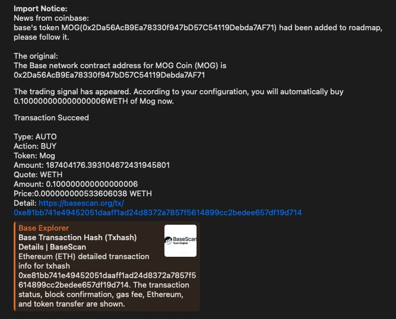

# Welcome   

## Introduction   
The spider bot can quickly and easily trade tokens on the Solana, Ethererum, and Base chains.   
   
Bot：https://t.me/spider_tge_sniper_bot   
Community://t.me/officialspider_bot     
Contact：https://t.me/Mark20172022   

## Highlight   
Low transaction fee:   
The transaction fee on the Solana chain is 1%, and there is no transaction fee on the Ethererum and Base chains.   

Monitoring listing information:   
The bot will monitor the coin listing information of Okx, Binance, Coinbase, and Upbit exchanges at any time and push the information to users.   

Automatic buy new TGE token:   
After the bot detects the new listing information of Coinbase, it will automatically buy the token on the corresponding chain.   

Security:   
The bot will detect the security of Solana tokens, including the freezing and modification permissions of tokens.   

Operability:   
After the user sets the  configuration once, there is no need to intervene. The bot will automatically buy tokens and notify the user.   
Users can also buy and sell tokens manually with one click through the UI.   

Limit order (coming soon):   
Tokens on the Solana chain can be placed in advance.   

## Quick Transaction Instructions
Steps:   
1. Start the robot via /start.   
2. The robot will automatically generate Solana, Ethereum and Base addresses for the user.      
3. Deposit SOL, ETH (ethereum), ETH (Base) to the address.      
4. Configure the robot: set slippage, language.   
5. Trade by clicking the "Manual Buy and Sell" button.   
   
Settings:   
1. Slippage: The default slippage is 1%, which is effective for Solana.   
2. Language: Supports Chinese and English.    

Deposit:       

1. Transaction:      
   
Transaction recharge means recharging your own address, and you can make transactions after recharging.     
   
2. WeathCode:   
      
After successfully recharging the designated address, the user can receive information about the exchange’s listing event and can open the automatic buy tge token function.    
   
    
After the recharge is successful, you can configure the automatic buy tge token parameters as shown in the above picture.   
   
3. News:     
   
After successfully recharging the designated address, the user can configure the group to receive news, and the bot will push news to the designated group every hour.      

4. UpgradeAccount   
   
After successfully recharging the designated address, the user can be upgraded to a KOL. KOL transactions are free of handling fees, and the handling fees generated by users invited by the KOL will be transferred to the KOL's account.    
   
Withdraw:      
    
Users can withdraw main chain coins (SOL, ETH) and tokens. There is no handling fee for withdrawal.   

Exchange:         
   
Users can use this function to exchange ETH to WETH or WETH to ETH. WETH is used for exchange on Ethererum and Base chains.     
   
Trade:      
   
The above picture shows a manual transaction by a user. You need to select a chain, input the token contract address, and the transaction amount.   
   
   
The above picture shows an automatic buy tge token transaction. After the new transaction is successful, the bot will automatically push the transaction information to the user.